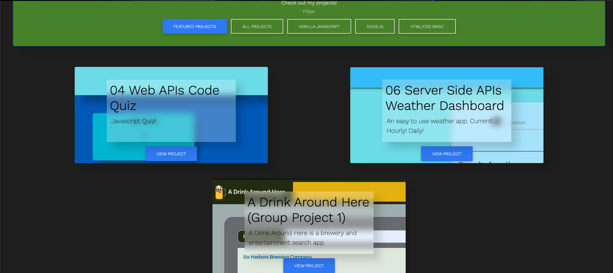

# Ethan Harsh Portfolio (HW8)
   

## Deployed Application
[Portfolio](https://ethanharsh.com)

## Description
I needed a portfolio to display my development work.  I decided to build the portfolio using Node.js, Express, & EJS.

Project Goals:
- Add all new projects
- Show 3 feature projects
- Add contact page with form that sends a notification email when form is filled out
- Store form contact data into database

## Skills Learned
- [HTML/CSS](https://www.w3.org/standards/webdesign/htmlcss)
- [EJS](https://ejs.co/)
- [Semantic HTML](https://developer.mozilla.org/en-US/docs/Learn/Accessibility/HTML)
- [Advanced CSS](https://developer.mozilla.org/en-US/docs/Learn/CSS/Building_blocks/Advanced_styling_effects)
- [MongoDB](https://developer.mozilla.org/en-US/docs/Web/HTML/Element/form)
- [Node.js](https://developer.mozilla.org/en-US/docs/Glossary/Node.js?utm_campaign=feed&utm_medium=rss&utm_source=developer.mozilla.org)
- [Express](https://developer.mozilla.org/en-US/docs/Learn/Server-side/Express_Nodejs)
- [Materialize](https://materializecss.com/)
## Resources
- [Node.js Documentation](https://nodejs.org/en/docs/)
- [Express](https://expressjs.com/)
- **Design ->** [Material.io](https://material.io/)
- **General Reference ->** [MDN](https://developer.mozilla.org/en-US/)
