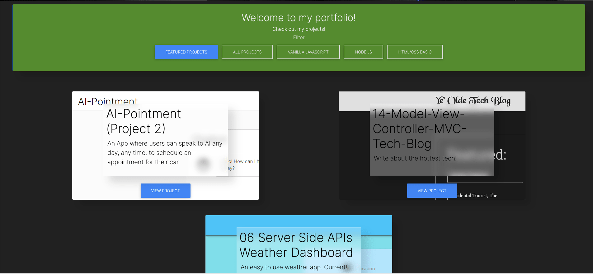

# Ethan Harsh Portfolio (HW16)
   

## Deployed Application
[Portfolio](https://ethanharsh.com)

## Description
I needed a portfolio to display my development work.  I decided to build the portfolio using Node.js, Express, & EJS.  This is a continuation of previous repos.  I have been changing repos so I can see the differences in my coding at the end of the course.

[Version 1.1 Repo](https://github.com/EthanHarsh/ethanharsh-portfolio-hw2)

[Version 1.2 Repo](https://github.com/EthanHarsh/08-Project-1-Professional-Materials)

[Version 1.1 Deployed](https://portfolio-hw2.herokuapp.com/)

[Version 1.2 Deployed](https://portfolio-v1-2-project1-update.herokuapp.com/)

Version 1.3 Changes:
- Add all new projects
- Show 2 new feature projects
- Changed card sizes to display more information
- Changed font from Work-Sans to Inter
- Reduced image sizes significantly
- Now displays projects in reverse chronological order (newest project first)
- Changed Navbar color
- Changed contact form color
- Uploaded archive of v1.2 to heroku

## Skills Learned
- [HTML/CSS](https://www.w3.org/standards/webdesign/htmlcss)
- [EJS](https://ejs.co/)
- [Semantic HTML](https://developer.mozilla.org/en-US/docs/Learn/Accessibility/HTML)
- [Advanced CSS](https://developer.mozilla.org/en-US/docs/Learn/CSS/Building_blocks/Advanced_styling_effects)
- [MongoDB](https://developer.mozilla.org/en-US/docs/Web/HTML/Element/form)
- [Node.js](https://developer.mozilla.org/en-US/docs/Glossary/Node.js?utm_campaign=feed&utm_medium=rss&utm_source=developer.mozilla.org)
- [Express](https://developer.mozilla.org/en-US/docs/Learn/Server-side/Express_Nodejs)
- [MDBootstrap](https://mdbootstrap.com/)
## Resources
- [Node.js Documentation](https://nodejs.org/en/docs/)
- [Express](https://expressjs.com/)
- **Design ->** [Material.io](https://material.io/)
- **General Reference ->** [MDN](https://developer.mozilla.org/en-US/)
